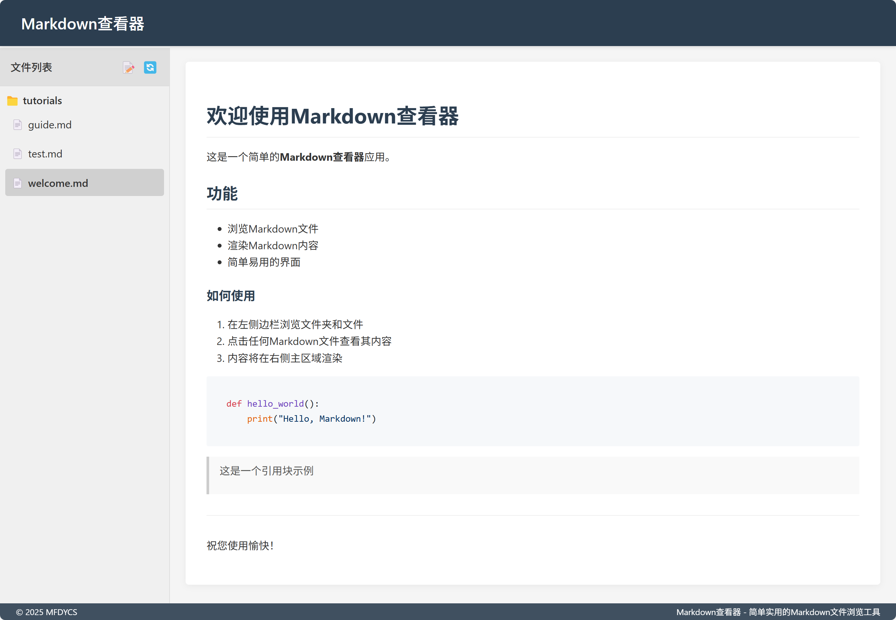

# Markdown Viewer

A simple web application for viewing and editing Markdown files with syntax highlighting support.

[中文文档](README_zh.md)

 

## Features

- Browse and view Markdown files in a tree structure
- Edit Markdown files with a built-in editor
- Syntax highlighting for code blocks
- Create new Markdown files
- Delete existing files
- Responsive design
- Support for nested directories

## Requirements

- Python 3.6+
- Flask
- Markdown
- Pygments

## Installation

1. Clone the repository:
```bash
git clone https://github.com/yourusername/markdown-viewer.git
cd markdown-viewer
```

2. Install dependencies:
```bash
pip install -r requirements.txt
```

3. Run the application:
```bash
python app.py
```

4. Open your browser and visit:
```
http://localhost:5000
```

## Project Structure

```
markdown-viewer/
├── app.py              # Main application file
├── requirements.txt    # Python dependencies
├── static/            # Static files
│   ├── css/          # CSS styles
│   └── js/           # JavaScript files
├── templates/         # HTML templates
└── markdown/         # Directory for Markdown files
```

## License

This project is licensed under the MIT License - see the [LICENSE](LICENSE) file for details. 