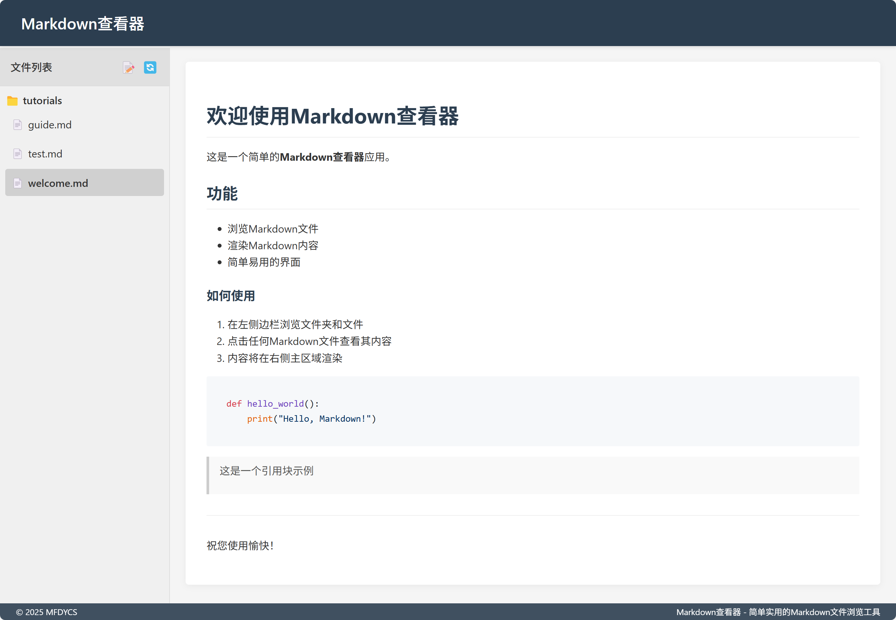

# Markdown 查看器

一个简单的网页应用，用于查看和编辑 Markdown 文件，支持代码高亮显示。

[English](README.md)

 

## 功能特点

- 树形结构浏览和查看 Markdown 文件
- 内置 Markdown 编辑器
- 代码块语法高亮
- 创建新的 Markdown 文件
- 删除现有文件
- 响应式设计
- 支持嵌套目录

## 系统要求

- Python 3.6+
- Flask
- Markdown
- Pygments

## 安装说明

1. 克隆仓库：
```bash
git clone https://github.com/yourusername/markdown-viewer.git
cd markdown-viewer
```

2. 安装依赖：
```bash
pip install -r requirements.txt
```

3. 运行应用：
```bash
python app.py
```

4. 在浏览器中访问：
```
http://localhost:5000
```

## 项目结构

```
markdown-viewer/
├── app.py              # 主应用文件
├── requirements.txt    # Python 依赖
├── static/            # 静态文件
│   ├── css/          # CSS 样式
│   └── js/           # JavaScript 文件
├── templates/         # HTML 模板
└── markdown/         # Markdown 文件目录
```

## 许可证

本项目采用 MIT 许可证 - 详见 [LICENSE](LICENSE) 文件。 